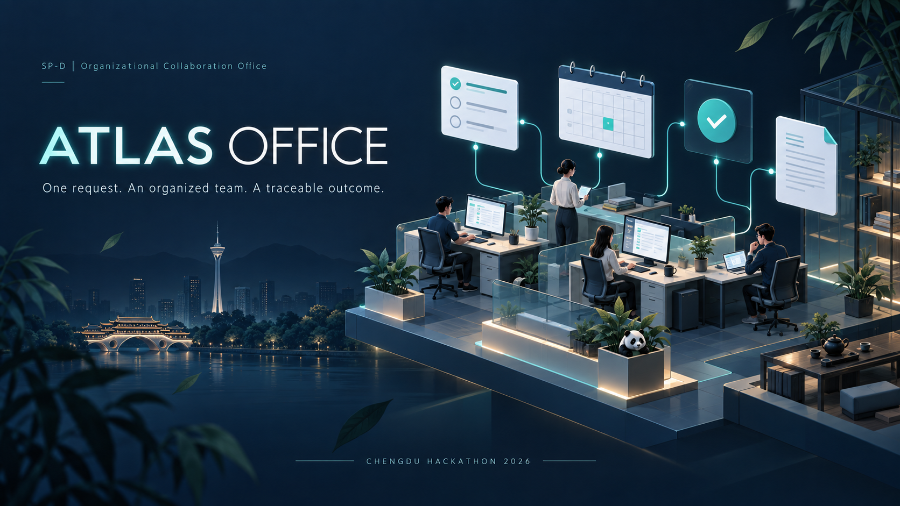

# Atlas Office

An organizational collaboration workspace for launch preparation, office tasks and a specialized Chengdu tourism workflow.

**Repository:** [energelpen/1010-Chengdu-Hackathon](https://github.com/energelpen/1010-Chengdu-Hackathon)



## Submission and demonstration

The [submission folder](submission/README.md) contains the three upload PDFs, implementation demo, cover and a paste-ready summary. The API PDF documents all **69 registered skills**, including their parameters, effects and examples.

[Download all submission materials](submission/atlas-office-submission.zip) · [Download the skills source ZIP](submission/atlas-office-skills-source.zip)

**Voluntary Track B source supplement — Team Atlas, Singapore Polytechnic:** [Download the documented original-source ZIP](submission/Atlas-Singapore-Polytechnic-Agent-Skill-Source.zip). It includes all 69 individual `SKILL.md` files plus the top-level skill instructions, the complete app source, a reviewer guide, a linked skill index, recorded execution evidence, an email draft, and a SHA-256 manifest with a verification script. Extract the ZIP and start with its `README.md`.

- [Watch or download the implementation demo](submission/03-implementation-demo.mp4)
- [Skill function description](submission/01-skill-function-description.pdf)
- [API documentation](submission/02-api-documentation.pdf)
- [Enterprise challenge fit statement](submission/04-enterprise-challenge-fit.pdf)
- [Entry summary](submission/06-entry-summary.txt)
- [Demo script and recording notes](submission/demo-script.md)

The video includes a product tour of the organisation chart, people, skill library, recorded launch approach, activity and approvals, files and knowledge, workspace settings, connections and API reference, alongside the real agent-led execution.

The narrated demo shows **one request driving an agent-led Product Launch Preparation simulation**. The recorded run completed 20 skill executions across 16 distinct skills and 7 fictional colleagues, producing 10 real files. It used 24 model requests and 26 tool calls; reported usage totaled 800,795 tokens across requests. Actual wall time was 303.8 seconds. The agent compares pilot and full-launch options, checks team capacity, records decisions, schedules dependencies, maps responsibility, prepares a campaign and launch checklist, tracks tasks, assesses risk, calculates budget variance and a finance forecast, creates the executive pack, and saves and retrieves reusable knowledge. The pack includes editable Word, PowerPoint and Excel files plus a PDF report.

One user brief starts a real configured OpenAI model. The model chooses the skills, publishes a dependency-aware plan, assigns qualified colleagues, supplies the inputs and executes local work through the shared runtime. The recording contains no manual skill submissions. All business facts and launch outcomes are explicitly simulated; no external delivery, spending or real product release occurs. Execution evidence and generated files are retained in the submission evidence folder.

## Run locally

Requires Python 3.11 or newer. Run these commands from this repository:

```powershell
cd chengdu-tourism-office
python -m venv .venv
.venv\Scripts\python.exe -m pip install -r requirements.txt
.venv\Scripts\python.exe app.py
```

Open **http://127.0.0.1:8765**. Use **Skills library** for local tools, **Activity & approvals** for recorded runs and review, and **Files & knowledge** for artifacts. The default General company template supports the launch preparation recording. Select **Chengdu tourism** in Workspace settings for the integrated tourism RFQ simulation.

For a clean demonstration workspace:

```powershell
.venv\Scripts\python.exe app.py --data-dir ./demo-state
```

Local typed skills work without an API key. In the general-company template, free-form chat tool use requires the configured OpenAI connection. No-key chat provides directory/help responses; it does not automatically execute a launch proposal. Optional Google Workspace, Telegram, SMTP and external MCP integrations require separate configuration. External and reviewed writes wait for review.

The app binds to loopback and is a single-user prototype. A shared deployment requires identity, authorization and an appropriate HTTPS server. See the [application guide](chengdu-tourism-office/README.md) for configuration and boundaries.

## What is implemented

| Capability | Implementation |
|---|---|
| Organization | Editable fictional colleagues, roles, managers, skills, capacity and follow links |
| Execution | Shared runtime across browser forms, HTTP, CLI and MCP; schema validation, run records, artifacts and review states |
| General office | Documents, spreadsheets, presentations, finance, project work, governance and optional connected actions |
| Tourism | Nine independently callable stages from inquiry intake to evidence-gated outcome reporting |
| Traceability | Saved conversations, activity, audit records, search and inspectable outputs |
| Review | Pending external writes; reviewed local file copies; tourism proposal revision and escalation |

The tourism stages are `inquiry-intake`, `flight-search`, `tour-search`, `option-comparison`, `hierarchy-router`, `workload-splitter`, `schedule-builder`, `execution-controller` and `outcome-reporter`. Five handlers currently retain legacy inner `skill` labels; requested routes and the shared runtime's outer `skill_id` identify the invoked stage. The API PDF documents this limitation.

## Verify

From `chengdu-tourism-office`:

```powershell
.venv\Scripts\python.exe scripts/tourism_office.py test
.venv\Scripts\python.exe -m unittest discover -s tests -p "test_*.py" -q
.venv\Scripts\python.exe tests/trigger_eval.py
```

On 27 September 2026, the submission checks passed **180 tourism behavior cases**, **51 automated tests**, and **43/43 fixed action-routing prompts plus 5/5 non-action prompts**. The 180 decision cases are separate from the 51 automated tests. These bounded checks are not evidence of arbitrary-language success, enterprise savings or live connector delivery. [Captured logs](submission/source/verification/) preserve their scope.

## API and source map

- Local interactive documentation: http://127.0.0.1:8765/docs
- OpenAPI: http://127.0.0.1:8765/openapi.json
- [API guide](chengdu-tourism-office/references/api.md) and [full submission reference](submission/02-api-documentation.pdf)
- [Skill instructions](chengdu-tourism-office/SKILL.md), [skill library](chengdu-tourism-office/skills/), [MCP setup](chengdu-tourism-office/references/mcp-setup.md)
- [Source register](chengdu-tourism-office/references/source-register.md) and [demonstration domain rules](chengdu-tourism-office/resources/domain-rules.md)

Public enterprise context informs the tourism design. The named enterprise has not supplied private SOPs, endorsed the software or adopted the prototype. Synthetic prices and rules are marked as demonstration assumptions. The supplied competition PDFs are preserved at repository root for traceable requirements.

Credentials, personal runtime databases, virtual environments, temporary recording tools and browser profiles are excluded from version control.
